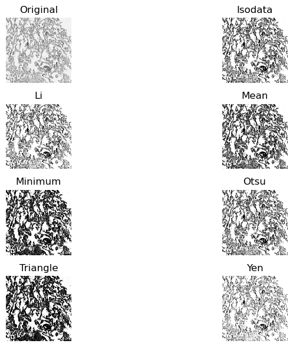
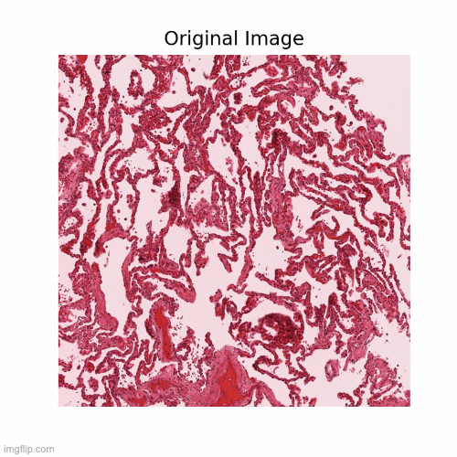

# spatialomics_utils
Functions for spatial omics data analysis

## Includes:
### 1. Tissue-background segmentation
- Simply define a threshold to distinguish between background and tissue region. 
- Overview of all algorithms:

### 2. Mask dilation
- Image dilation: Broaden the "mask" to the black pixels, within the defined radius
- Coordinates dilation: Dilate "Unlabeled" point to its nearest "Labeled" point, within the defined radius

### 3. Convert Anndata <-> Rds
- Mitigate dependency on other pre-build packages
- Break anndata/rds object into small components (.mtx, .csv), then build up rds/anndata

### 4. Reading Ome.Tiff
- Lazyly crop Ome Tiff image without loading huge image to the RAM